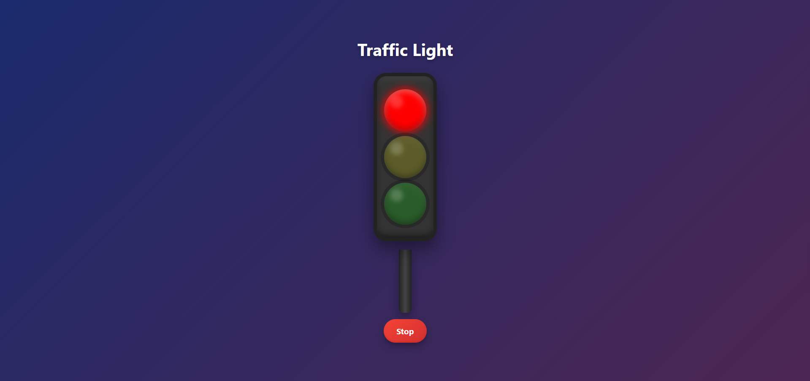

# Auto Traffic Signal

## Description

A dynamic traffic light simulation that automatically cycles through stop, steady, and go signals using pure HTML, CSS, and JavaScript. This project creates a realistic traffic signal that changes states at regular intervals without user interaction.

## 🚦 Overview

Auto Traffic Signal simulates a standard traffic light system with three states:

- **Stop** (Red light)
- **Steady** (Yellow light)
- **Go** (Green light)

## ✨ Features

- **Fully Automated**: Lights change automatically at regular intervals
- **Visual Indicators**: Clear visual representation of each traffic signal state
- **Status Messages**: Text indicators showing the current signal state
- **Continuous Operation**: Infinite loop of signal changes
- **Responsive Design**: Works on various screen sizes
- **Lightweight**: Built with vanilla JavaScript without external dependencies

## 🔍 Live Demo

[View Live Demo](https://alimohaamed.github.io/Auto-Traffic-Signal/)

## Technologies Used

- **HTML**: Structure of the traffic light system.
- **CSS**: Styling and animations for realistic light transitions.
- **JavaScript**: Controls the automatic switching of traffic signals.

## How It Works

1. The traffic light has three colors: Red, Yellow, and Green.
2. The lights switch automatically every second in a loop.
3. The current active light is highlighted using CSS classes.

## Installation & Usage

### Steps to Run the Project:

1. Download or clone the repository.
2. Open the `index.html` file in any modern web browser.
3. Watch the traffic light simulation in action.

## Code Overview

### JavaScript Functionality

- The script selects all traffic light elements and messages.
- A loop updates the active light every second.
- Previous active lights are deactivated before activating the next one.

### CSS Styling

- The lights have a base state with dimmed colors.
- The active light glows brightly with a shadow effect.
- Responsive adjustments for mobile devices.

## Future Enhancements

- Add manual control buttons for switching lights.
- Implement a pedestrian crossing feature.
- Enhance the timing intervals to mimic real traffic scenarios.

## License

This project is open-source and available for modification and use.
